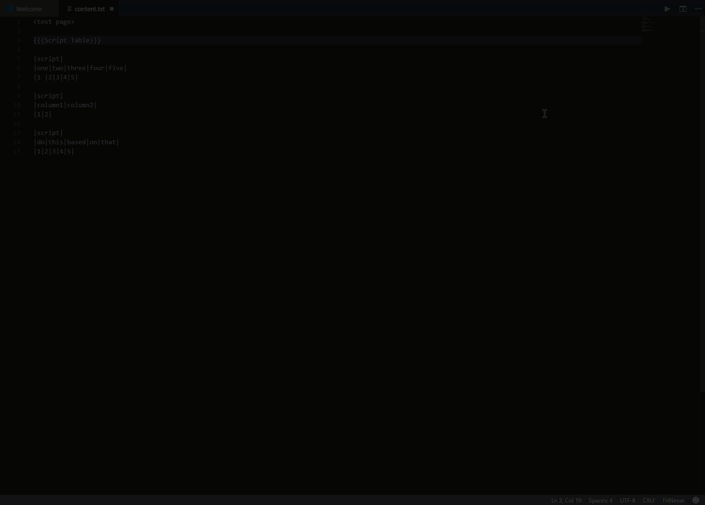

# VS Code FitNesse

A Visual Studio Code extension for formatting your FitNesse tests.

## Features

 * Adds new language to VS Code
    * By adding the language it ensures that the formatting only applies to content.txt files that get created with FitNesse
    * Allows for auto pairing on some of the FitNesse makrup style's character formatting
 * Formats content.txt FitNesse files on save

## Requirements

Be on the latest version of VS Code (utilizes workspaces), other than that there are no requirements or configurations for the end user to set up. 

## Known Issues

> As of right now only works with context.txt files any other kind of test caching or file extensions do not work. I believe the latest version of FitNesse comes
> with a new .wiki extension. If you need to format the .wiki file extension please log an issue to the github page. 

## Release Notes

### 1.0.0

Initial release of VS Code FitNesse.
Includes all main functional requirements outlined in the feature section. 